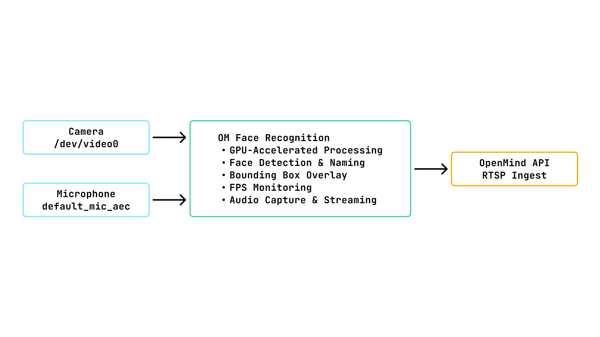

OM1 supports Full Autonomy Mode on both Nvidia AGX and Thor platforms, enabling advanced perception, mapping, navigation, and interaction capabilities with minimal human input.

   - AGX: Supported with a limited feature set.

   - Thor: Provides comprehensive support for full autonomy.

On the Nvidia Thor platform, OM1 includes advanced machine learning capabilities such as:

   - Face recognition

   - Anonymization

Thor is fully supported and optimized for ML-driven workloads, making it the recommended platform for deployments requiring advanced autonomy and perception features.

The Full Autonomy stack is built from modular, containerized services that communicate through well-defined interfaces. The diagram below shows how these components interact within the system.

## Core Components
OM1’s full autonomy is powered by the following tightly integrated services, each running in its own container and communicating in real time:

### 1. OM1 (`om1`)
The central intelligence of the system, responsible for:
- High-level decision making and behavior planning
- Natural language understanding and generation
- Task planning and execution monitoring
- Integration with external AI services

### 2. OM1 ROS2 SDK (`om1-ros2-sdk`)
The robotics middleware that provides:
- Sensor data acquisition and processing
- SLAM (Simultaneous Localization and Mapping)
- Navigation and motion planning
- Low-level robot control
- Auto charging

The `om1-ros2-sdk` consists of the following:

- om1_sensor: Handles all low-level sensor drivers (Intel RealSense D435, RPLidar). It collects and publishes sensor data to ROS2 topics for localization and mapping.
- orchestrator: Manages SLAM, navigation, and map storage. Provides REST API endpoints for control and integration. It consumes the data published by `om1_sensor` for SLAM and navigation.
- watchdog: Monitors sensor and topic health, automatically restarting om1_sensor if issues are detected.
- zenoh_bridge: Acts as a bridge between OM1 and OM1_sensor to publish and subscribe to/from ROS2 topics.

### 3. OM1 Avatar (`om1-avatar`)
Frontend interface components:
- React-based user interface
- Real-time avatar rendering
- System status visualization
- User interaction layer
- Runs on the robot's BrainPack screen

### 4. Video Processor (`om1-video-processor`)
Media handling subsystem:
- Camera feed processing
- Face detection and recognition
- Video and audio streaming to RTSP server
- Face detection and anonymisation
- Performance monitoring
- Optimised for NVIDIA Jetson platforms with CUDA support

#### What is RTSP?
- RTSP (Real Time Streaming Protocol) is a network control protocol designed to manage multimedia streaming sessions.
- It functions as a "remote control" for media servers, establishing and controlling one or more time-synchronized streams of continuous media such as audio and video.

#### Key characteristics:

- Control Protocol: RTSP manages streaming sessions but does not typically transport the media data itself
- Session Management: Establishes, maintains, and terminates streaming sessions
- Time Synchronization: Coordinates multiple media streams (audio/video) to play in sync
- Network Remote Control: Provides VCR-like commands (play, pause, stop, seek) for media playback over a network

#### Architecture Diagram

#### Openmind privacy system

It runs entirely on the **robot's edge device** and automatically blurs the faces to prevent any personal information from leaking. Frames never leave the device; only the blurred output is saved or streamed. It works offline and keeps latency low for real-time use.

**How it works**

- Find faces (SCRFD) – Each frame is scanned with the face detector. The model is robust to different angles and lighting. It is optimized with TensorRT, so inference is fast.
- After it locates the face with bounding box, we expand the region around the face bounding box, create a smooth mask, and apply strong Gaussian blur so identity wouldn't leak or be recovered.

We prioritize safety and want to protect everyone's identity – when in doubt (low confidence, motion blur, occlusion), we focus on the side of privacy and blur anyway.

We currently provide full autonomy for Unitree G1 and Go2 through the BrainPack.

### 5. System Setup

#### ota_agent

Key functions:
- Pull new images
- Start and stop containers
- Restart services
- Upgrade existing images

This is the main service responsible for OTA (Over-The-Air) application lifecycle management.

#### ota_updater

Ota_updater is used to update the OTA_agent.

Key functions:
- Updates the OTA agent to the latest version
- Ensures compatibility with new features and fixes
- This service guarantees that the OTA system can evolve without manual intervention.

#### om1_monitor
This service is used for setting up the Wi-Fi, local network, and local status page.

Key functions:
- Wi-Fi configuration
- Local network setup
- Local status and monitoring page

This service exposes a web interface for initial device configuration.

## System Architecture
1. **Sensor Data Collection** - The OM1-ros2-sdk gathers data from sensors such as LiDAR and cameras, publishing ROS2 topics for localization and mapping.

2. **Autonomous Decision-Making** - The om1 agent receives processed sensor data, user and system prompts, system governance and issues commands for navigation, exploration, and interaction, enabling the robot to operate independently.

3. **Continuous Monitoring** - The watchdog service within the ROS2 SDK monitors sensor and topic health, automatically restarting components if issues are detected to ensure reliability.

4. **User Interaction** - The om1-avatar frontend displays robot avatars, allowing you to interact with your robot in real time via the BrainPack screen. It is designed to work in conjunction with OM1 robotics backend systems and hardware components.

5. **RTSP Streaming** - The om1-video-processor component streams video and audio data to an RTSP server, enabling real-time video and audio streaming to external systems.

6. **Openmind Privacy System - Face detection and Anonymisation** - A real-time, on-device face detection and blurring module designed to protect personal identity during video capture and streaming. It runs entirely on the robot’s edge device, requiring no cloud or network connectivity.

7. **Auto charging** - The system uses AprilTag-based visual docking combined with Nav2 navigation. When the robot needs to charge, it navigates to the charging station's general area using the Nav2 stack. Once nearby, it switches to precision docking mode where it detects AprilTags mounted on or near the charging dock using its onboard cameras.

    The docking process involves:
        - Visual servoing - The robot aligns itself with the charging station by tracking the AprilTag's pose
        - Precise approach - It approaches the dock using the tag's position and orientation data
        - Physical docking - The robot positions itself so its charging contacts align with the charging pad's contact points

   Currently, auto-charging is only supported for Go2.

## What Happens Next

- The BrainPack screen will launch the OM1-avatar frontend, providing a live interface for robot status and control.
- The robot will begin autonomous operation, navigating, mapping, and learning from its environment.
- The om1-video-processor streams video and audio data to an RTSP server, enabling real-time video and audio processing.
- You can now interact with your robot through the user interface.

---

Your robot is now ready to accompany you, assist with tasks, explore new environments, and learn alongside you.
